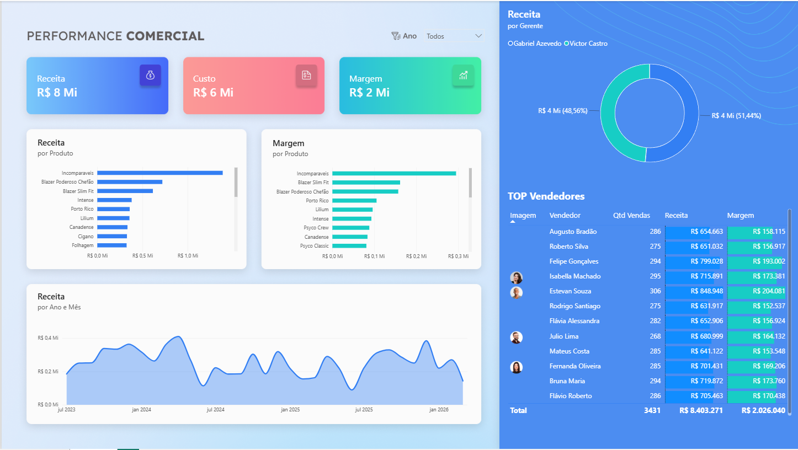

# 📈 Performance Comercial Dashboard

---

# 📖 Sobre

Dashboard executivo desenvolvido para acompanhar o desempenho comercial da empresa através de indicadores de vendas, receita, margem de lucro e performance dos vendedores.

O projeto foi construído utilizando Microsoft Excel como fonte de dados e Power BI para modelagem, cálculos e visualização.

---

# 🎯 Objetivos

- Monitorar receitas
- Avaliar margem de lucro
- Comparar desempenho dos vendedores
- Identificar produtos mais lucrativos
- Acompanhar evolução das vendas

---

# 📊 Indicadores

- Receita Total
- Custos
- Margem
- Receita por Gerente
- Receita por Produto
- Margem por Produto
- Ranking dos Vendedores
- Receita Mensal

---

# 🛠 Tecnologias

- Power BI
- Excel
- Power Query
- DAX

---

# 🚀 Competências

- Business Intelligence
- Data Visualization
- Dashboard Executivo
- DAX
- Modelagem de Dados
